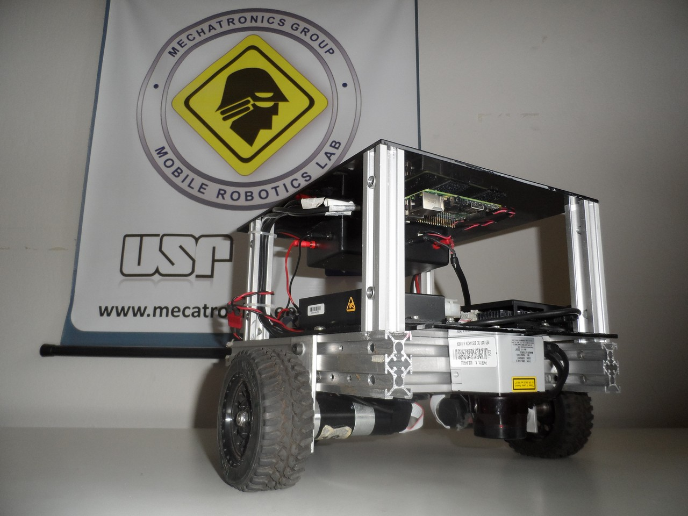

# Introdução de ROS e robôs móveis terrestres

Até o momento, fizemos o [primeiro subscritor](https://github.com/akihirohh/gmr_intro) e mexemos com [parâmetros e roslaunch](https://github.com/akihirohh/gmr_intro_1) sem nos importar com a aplicação em si. O que temos aqui é um robô com tração diferencial (*differential drive robot*) cujas velocidades angulares dos motores são publicadas em rotações por minuto [rpm] e cujos parâmetros conhecidos são: a) Raio da roda (*/wheel_radius*); b) Relação de transmissão devido à caixa de redução entre o motor e a roda (*/gear_ratio*); c) Pista do eixo/distância transversal entre o centro das rodas. Um robô com tração diferencial é bastante simples (Figura 1): duas rodas atuadas independentemente e presença de apoios/rodízios para o equilíbrio tridimensional do robô.

 
 **Figura 1**: Exemplo de robô com tração diferencial

 A cinemática é bastante simplificada em que temos que a velocidade linear e angular do robô podem ser expressas em função das velocidades dos motores:

